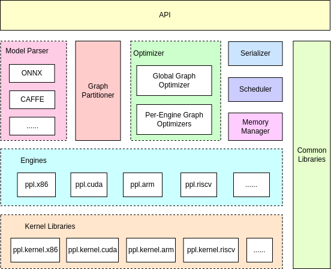

# PPLNN

[](https://openppl.ai/)
[](LICENSE)
[](https://qm.qq.com/cgi-bin/qm/qr?k=X7JWUqOdBih71dUU9AZF2gD3PKjxaxB-)
[](https://www.zhihu.com/people/openppl)

### Overview

`PPLNN`, which is short for "**P**PLNN is a **P**rimitive **L**ibrary for **N**eural **N**etwork", is a high-performance deep-learning inference engine for efficient AI inferencing. It can run various ONNX models and has better support for [OpenMMLab](https://github.com/open-mmlab).



### Hello, world!

* Installing prerequisites:

    - On Debian or Ubuntu:

    ```bash
    apt-get install build-essential cmake git python3 python3-dev
    ```

    - On RedHat or CentOS:

    ```bash
    yum install gcc gcc-c++ cmake3 make git python3 python3-devel
    ```

* Cloning source code:

```bash
git clone https://github.com/openppl-public/ppl.nn.git
```

* Building from source:

```bash
cd ppl.nn
./build.sh -DHPCC_USE_X86_64=ON -DPPLNN_ENABLE_PYTHON_API=ON
```

* Running python demo:

```bash
PYTHONPATH=./pplnn-build/install/lib python3 ./tools/pplnn.py --use-x86 --onnx-model tests/testdata/conv.onnx
```

Refer to [Documents](#documents) for more details.

### Documents

* Ops and Models
  - [Supported Precison](docs/en/supported-ops-and-platforms.md)
  - [Supported Ops and Platforms](docs/en/supported-ops-and-platforms.md)
  - [Converting ONNX Opset](docs/en/onnx-model-opset-convert-guide.md)
  - [Generating ONNX models from OpenMMLab](docs/en/model-convert-guide.md)
* [Building from Source](docs/en/building-from-source.md)
* APIs
  - C++
    - [Getting Started](docs/en/cpp-getting-started.md)
    - [API Reference](docs/en/cpp-api-reference.md)
  - Python
    - [Getting Started](docs/en/python-getting-started.md)
    - [API Reference](docs/en/python-api-reference.md)
  - Lua
    - [Getting Started](docs/en/lua-getting-started.md)
    - [API Reference](docs/en/lua-api-reference.md)
* Develop Guide
  - [Adding New Engines and Ops](docs/en/add-new-engines-and-ops.md)
  - X86
    - [Adding Ops](docs/en/x86-doc/add_op.md)（[中文版](docs/cn/x86-doc/add_op.md)）
    - [Benchmark](docs/en/x86-doc/benchmark_tool.md)（[中文版](docs/cn/x86-doc/benchmark_tool.md)）
  - CUDA
    - [Adding Ops](docs/en/cuda-doc/add_op.md)（[中文版](docs/cn/cuda-doc/add_op.md)）
    - [Benchmark](docs/en/cuda-doc/benchmark_tool.md)（[中文版](docs/cn/cuda-doc/benchmark_tool.md)）

### Contact Us

Questions, reports, and suggestions are welcome through GitHub Issues!

| WeChat Official Account | QQ Group |
| :----:| :----: |
| OpenPPL | 627853444 |
| |  |

### Contributions

This project uses [Contributor Covenant](https://www.contributor-covenant.org/) as code of conduct. Any contributions would be highly appreciated.

### Acknowledgements

* [onnxruntime](https://github.com/microsoft/onnxruntime)
* [onnx](https://github.com/onnx/onnx)
* [openvino](https://github.com/openvinotoolkit/openvino)
* [oneDNN](https://github.com/oneapi-src/oneDNN)
* [TensorRT](https://github.com/NVIDIA/TensorRT)
* [OpenMMLab](https://github.com/open-mmlab)

### License

This project is distributed under the [Apache License, Version 2.0](LICENSE).
