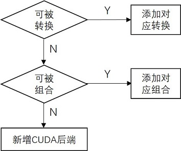

## 1. 自定义算子添加

添加自定义算子需要先添加算子定义及其在不同架构上的实现。本章仅介绍在cuda架构上添加算子的实现细节。

### 1. 概述

`PPLNN`算子cuda实现步骤如下:

1) 添加算子定义(若本身存在参数，则需要导入算子参数)
2) 添加算子输入输出的数据类型
3) 添加算子维度计算
4) 添加算子数据排布
5) 添加算子调用接口
6) 添加算子的cuda后端的kernel实现
7) 注册算子

### 2. 添加算子定义

添加算子类型名称以MyOp为例。

首先，在ppl/nn/engines/cuda/optimizer/ops文件下创建一个新的文件夹，如MyOps。在该文件下通过创建MyOp.h文件来添加自定义算子。

若算子存在参数，在MyOp.h中添加参数的实例用于保存相关参数；同时，在src/ppl/common/params/ppl文件下创建myop_param.h，用于添加算子参数的定义。

MyOp.h结构如下:

```C++
class MyOp final : public CudaOptKernel {
public:
    MyOp(const ir::Node* node) : CudaOptKernel(node) {}
    KernelImpl* CreateKernelImpl() const override;
    ppl::common::RetCode Init(const OptKernelOptions&) override;
    ppl::common::RetCode Finalize(const OptKernelOptions& options) override;
private:
    ppl::common::MyOpParam param_;
};
```

### 3. 添加算子输入输出的数据类型

算子输入输出的数据类型通过`ppl::nn::cuda::MyOp::init()`中用自定义函数`infer_type_func`设置。目前有几个通用的函数可以调用:

```C++
InferDefaultType(info, type);  // 将所有input output设置为指定的type类型
InferHighestType(info, mask);  // 选择input中精度最高的类型，将所有input output设置为该类型
InferInheritedType(info);  // input保持上层输入的类型，并将output设置为input0的数据类型
```

用户可以选择合适的函数或者根据实际需求设计独立的函数。指定类型调用示例 (参数type在没有外部指定的情况下，默认为**DATATYPE_UNKNOWN**)

```C++
infer_type_func_ = [this] (InputOutputInfo* info, datatype_t type) -> RetCode {
	if (type == ppl::common::DATATYPE_UNKNOWN)
		type = ppl::common::DATATYPE_FLOAT16;
	return InferDefaultType(info, type);
};
```

### 4. 添加算子维度计算
算子形状推断通过`ppl::nn::cuda::MyOp::init()`中以自定义函数`infer_dims_func`设置。目前框架支持的所有onnx算子的形状推断在ppl/nn/oputils文件夹下，可用于参考。

输出形状继承输入形状的示例:

```C++
infer_dims_func_ = [this] (InputOutputInfo* info) -> RetCode {
	auto& in_shape0 = info->GetInput<TensorImpl>(0)->GetShape();
	info->GetOutput<TensorImpl>(0)->GetShape().Reshape
		(in_shape0.GetDims(), in_shape0.GetRealDimCount());
	return RC_SUCCESS;
};
```

### 5. 添加算子的数据排布
目前框架支持两种排布，**NDARRAY (NCHW)** 和 **NHWC**，根据这两种排布目前将所有算子的输入输出排布分为四种，新增算子具体使用那种排布可以在ppl/nn/engines/cuda/algos/algo_normal.h文件中设置。

默认设置为算子所有的输入输出都固定为**NDARRAY**，若自定义算子也使用**NDARRAY**输入输出的排布，则无需添加任何内容，其它情况操作遵循如下规则:

1) 若自定义算子仅支持输入输出为**NHWC**格式，则需要将自定义算子的名称写入`nhwc_set_`中；
2) 若自定义算子的输出与输入排布保持一致(类似`Add`算子)，则需要将自定义算子的名称写入`inherited_set_`中；
3) 若自定义算子可以接受所有排布的输入并且固定以**NDARRAY作为输出**(类似`Shape`算子)，则需要将自定义算子的名称写入`arbitrary_set_`中

此外，当自定义算子包含多种算法实现时，框架支持在预处理阶段进行选算法，统计每种算法的时间并将最优结果记录下来，让算子可以在执行过程中执行计算效率最高的算法。

添加选算法需要在ppl/nn/engines/cuda/algos文件夹下添加algo_myop.cc和algo_myop.h两个文件，并在algo_filter_manager.cc中进行注册。选算法实现过程可以借鉴alog_conv.h文件中的`TuringHMMAImpgemm::ExcuteTimer()`函数。

### 6. 添加算子调用接口

在ppl/nn/engines/cuda/kernels文件夹中添加一个新的文件夹MyKernels。在MyKernels中添加自定义算子的调用接口。常规算子只需要构造函数和`DoExcute()`两个函数；当自定义算子包含参数时，需要添加`SetParam()`函数。默认的`CanDoExcute()`函数不允许有空tensor作为输入。当自定义算子支持空tensor输入时需要重写`CanDoExcute()`函数(例如`Resize`算子)

调用接口声明示例:

```C++
class MyOpKernel : public CudaKernel {
public:
    MyOpKernel(const ir::Node* node) : CudaKernel(node) {}
    void SetParam(const ppl::common::MyOpParam* p) { param_ = p; }
private:
    ppl::common::RetCode DoExecute(KernelExecContext*) override;
private:
    const ppl::common::MyOpParam* param_ = nullptr;
};
```	

用户需要手动完成`DoExcute()`函数，调用自定义算子的cuda实现并将结果写入输出tensor。

### 7. 添加cuda实现



添加算子应秉持转换优先，组合次之，最后再新增后端实现的原则。这样既可以快速完成算子添加，也可以避免新添后端的功能校对和性能优化。这里通过展示OpenPPL中已有算子的实现来介绍三种添加算子的方法。

#### 7.1 算子转换

如果新增算子的功能是已有若干个算子的功能交集，则可以特化已有算子的子功能作为新增算子的特定模式，ONNX.DepthToSpace即是这种情况。在ppl.kernel.cuda/src/nn/depth_to_space.cu中可以看到，`DepthToSpace`的DCR(depth-column-row)模式可以通过`Resahpe`+`Transpose`来实现，而CDR (column-row-depth)和已有算子`SubpixelUp`的功能是一致的，直接调用即可。

#### 7.2 算子组合

对于无法通过转换实现的算子，可以试图分解算子的计算步骤，然后在每一步骤利用已有算子实现。ONNX.Softmax就可以通过这种方式实现，具体可见ppl.kernel.cuda/src/nn/softmax.cu。可以看到Softmax可以分解为Reduce+Sub+Exp+Reduce+Div五个子步骤，每个步骤都可以在已有算子中找到对应的实现。值得注意的是，为了在不同步骤之间传输数据，需要申请临时存储空间。申请临时空间的接口是ppl.nn/cuda/kernels中的`CalcTmpBufferSize(const KernelExecContext& ctx)`，空间的大小由算子的计算步骤决定。

#### 7.3新增后端

对于无法通过转换和组合实现的算子，可以新增该算子的CUDA实现。新增后端实现涉及ppl.kernel.cuda中的两个文件，分别是include中的头文件my_kernel.h和src中的实现文件my_kernel.cu。算子接口的命名和形参列表的顺序及类型都应参考已有接口的定义。CMakeLists.txt中已经实现了src目录下的文件搜索，所以无需改动。

### 8. 注册算子

最后需要在ppl/nn/engines/cuda/optimizer/opt_kernel_creator_manager.h中注册自定义算子，domain为域名，默认为空，type为算子类型名称，最后为MyOp.h中定义的算子类型。

若新增域名，BridgeOp需同时加入到新域名中。注册示例:

```C++
REGISTER_OPT_KERNEL_CREATOR("new_domain", "Bridge", BridgeOp);
REGISTER_OPT_KERNEL_CREATOR("new_domain", "MyOp", MyOp)
```