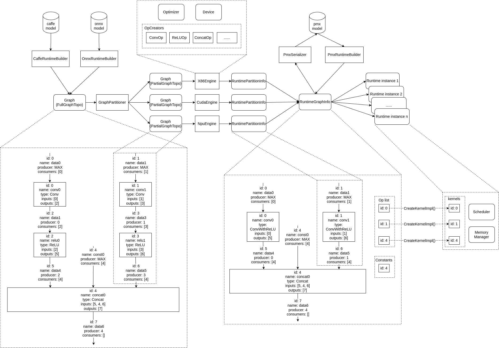
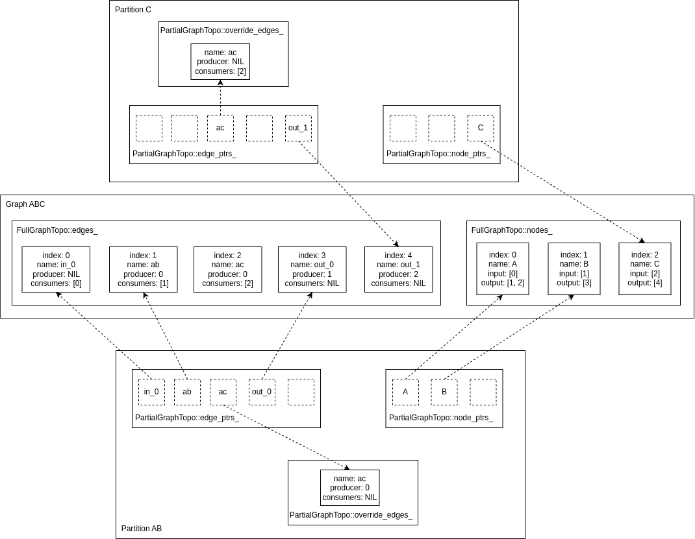

# 主要特性

* 支持多种模型格式，可以很方便地加入新的格式支持；
* 支持不同后端，也可以很方便地加入新后端；
* 支持将一个模型拆分成若干部分并交给多个异构设备后端执行；
* 支持不同层次的优化策略；
* 支持一个模型的多推理实例并行且共享权重数据；
* 支持执行模型的一部分；
* 框架开销比例 < 1%；
* ...

# 整体架构


# 代码结构

* `include`：对外暴露的接口；
* `cmake`：编译脚本；
* `docker`：构建用于运行 pplnn 的 docker 配置；
* `docs`：相关文档；
* `python`：python 接口封装；
* `samples`：例子集合；
* `src/ppl/nn`
    - `auxtools`：一些辅助工具，不涉及功能的实现；
    - `common`：一些公共库；
    - `engines`：后端支持，每种后端的支持都在 `engines` 目录下的一个子目录，例如 `engines/x86`；
    - `ir`：模型中间表示；
    - `models`：支持的模型格式，每种模型格式一个目录，例如 `models/onnx`；
    - `optimizers`：提供的一些通用优化实现，框架只提供实现，不会主动调用这些优化（`GenericOptimizerManager` 除外，这个会默认调用），需要各个后端按需调用；
    - `oputils`：和 op 相关的一些有用的函数；
    - `params`：op 属性定义；
    - `quantization`：量化配置文件解析；
    - `runtime`：推理运行时的代码；
    - `utils`：在实现中用到的一些有用的模块，大部分情况都会用到，非必需。
* `tests`：单元测试；
* `tools`：有用的工具。

编译出来的 lib 包括以下部分：

* `pplnn_basic_static`：这个是基本框架，包含除了 `engines` 和 `models` 之外的模块；
* `pplnn_onnx_static`：onnx 模型格式支持，由 `PPLNN_ENABLE_ONNX_MODEL` 控制是否编译，依赖 pplnn_basic_static；
* `pplnn_cuda_static`：cuda 支持，由 `PPLNN_USE_CUDA` 控制是否编译，依赖 pplnn_basic_static 和 cuda kernel；
* `pplnn_x86_static`：x86 支持，由 `PPLNN_USE_X86_64` 控制是否编译，依赖 pplnn_basic_static 和  x86 kernel；
* `pplnn_arm_static`：arm 支持，由 `PPLNN_USE_AARCH64` 控制是否编译，依赖 pplnn_basic_static 和 arm kernel；
* `pplnn_riscv_static`：riscv 支持，由 `PPLNN_USE_RISCV64` 控制是否编译，依赖 pplnn_basic_static 和 riscv kernel；
* ...

上面 lib 的依赖关系，在编译生成的 `pplnn-config.cmake` 中都配置好了，建议集成时直接导入这个配置文件。

# 主要数据结构



## EngineImpl/Engine

提供算子实现的后端。如果一个模型里面有 `Loop` 或 `If` 这样包含 `onnx::GraphProto` 的算子，那么在这些算子的实现中也有一个新的 `EngineImpl` 实例，这个实例是通过外部传进来的 `EngineImpl` 的 `Create()` 生成的。上面图中的 `X86Engine`/`CudaEngine`/`NpuEngine` 都是 `EngineImpl` 的派生类。

也负责保存在多个 `RuntimeImpl` 中需要被共享的数据，例如权重及其它。

生命周期贯穿整个推理过程，需要在 `RuntimeImpl` 之后释放。

`EngineImpl::ProcessGraph()` 是执行图优化的函数，结果保存在函数参数中的 `RuntimePartitionInfo`，同时参数列表中的 `ir::Graph::topo` 也要做相应的修改（`ir::Graph::data` 可以不同步修改，因为这部分是在 cpu 上的数据，当 builder 被删除后这部分数据也会被释放）。对于不需要拷到设备上的数据，也可以直接引用 `ir::Graph::data` 中的数据（是一个 shared_ptr 指针）从而减少拷贝。如果是其它设备的话则需要将数据拷贝到设备上，并保存在 `RuntimePartitionInfo::constants` 中（注意：这里要求把转换后的数据保存在 `RuntimePartitionInfo::cconstants` 中是因为序列化的时候会做去重以及压缩，这些工作最好由框架来统一处理）。

## EngineContext

`EngineContext` 是 `RuntimeImpl` 在执行过程中用到的和 engine 相关的内容，在生成 `RuntimeImpl` 的时候会调用 `EngineImpl::CreateEngineContext()` 生成，和 `RuntimeImpl` 实例一一对应。

## ppl::nn::onnx::RuntimeBuilderImpl

用于创建 `RuntimeImpl` 的数据结构。`builder->CreateRuntime()` 是线程安全的，可以在不同的线程并行执行，创建出来的多个 `RuntimeImpl` 可以在不同的线程并行执行，这些 `RuntimeImpl` 共享同一份模型数据。

builder 实例在创建完 `RuntimeImpl` 之后可以被释放以节约资源（主要是 `ir::Graph::data`）。

其它模型格式的 builder 类似。

## RuntimeImpl/Runtime

用于推理的核心数据结构，非线程安全。如果需要执行多个推理实例，可以通过 `builder->CreateRuntime()` 创建多个实例来执行。多个 `RuntimeImpl` 实例共享模型权重（或后端自己的其它数据）。

## OptKernel

保存算子在推理过程中所需的共享的只读数据（推理过程中不需要的数据不要保存，一般情况下会被修改的数据不要保存，如果需要保存会被修改的共享数据，注意多线程访问保护，在 pplnn 中，`OptKernel` 会被不同 `RuntimeImpl` 中的 `KernelImpl` 实例共享，而多个 `RuntimeImpl` 可能会被不同的线程使用）。`onnx::GraphProto` 中每个 `onnx::NodeProto` 实例和 `OptKernel` 实例一一对应。

## KernelImpl

每个 `RuntimeImpl` 实例中用于执行推理的算子实例，由 `OptKernel::CreateKernelImpl()` 生成，可以引用 `OptKernel` 中的只读数据。一个 `KernelImpl` 实例只在一个 `RuntimeImpl` 实例中，同一个 `OptKernel` 生成的多个 `KernelImpl` 可能位于不同的 `RuntimeImpl` 中。

`KernelImpl::Execute()` 是算子执行的入口函数。

## TensorImpl/Tensor

可以通过 `TensorImpl::SetBufferPtr()` 和  `TensorImpl::GetBufferPtr()` 来设置和获取数据指针。当使用外部设置指针，在内部调用 `TensorImpl::ReallocBuffer()` 时不会对 buffer 做任何操作，默认外部设置的指针可以满足数据大小。通过 `SetBufferPtr()` 设置指针时，必须保证所设置的指针能够被该 tensor 所使用的 device（`TensorImpl::GetDevice()` 返回的结果）操作。例如，cuda 后端 set ptr 的时候要注意所在的 device id。

## Device/DeviceContext

算子所用的设备抽象，主要是数据拷贝接口和数据类型转换操作的抽象。在框架的视角，一个 `EngineImpl` 实例只有一个 `Device` 实例，一个 kernel 只跑在一个 device 上。这里要注意的是 `Device` 是框架层面的抽象，并不要求和实际中的设备一一对应，例如，一个 `Device` 可以由多个 cuda 卡组成（自己管理 device id），或者是一个集群，等等。

## InputOutputInfo

用于隐藏获取 `Tensor`/`TensorSequence`/… 等结构的抽象，主要在 `KernelImpl::Execute()` 中使用，用于获取对应的输入输出，以及作为 `KernelImpl::Reshape()` 的参数。

例如，cuda 后端中，由于在图优化的时候需要对 shape 进行推导，推导函数是 `CudaOptKernel` 中的 `infer_dims_func` 和 `infer_type_func`，`KernelImpl::Reshape()` 通常就是调用这两个函数。

# 模型拆分和优化

入口函数是 src/ppl/nn/optimizers/utils.cc 中的 `ppl::nn::utils::ProcessGraph()`。

首先会调用通用的优化函数（`GenericOptimizerManager`），主要是一些简单的处理函数如 `Constant` 算子转成 tensor，去掉 `Dropout` 算子等等。

另外框架还提供了一些通用的优化函数，封装在 `NNOptimizerManager` 中。这些优化不是必须的，框架不会统一调用，由各个后端实现的 `EngineImpl::ProcessGraph()` 自己按需调用。

然后是使用 `EngineGraphPartitioner` 来对整个模型做拆分。目前默认的实现是按照 engine list 的顺序来分配算子，主要逻辑是，如果某个算子类型，第一个 engine 能够支持（`EngineImpl::Supports()` 返回 true），那么该算子就分给第一个 engine；否则检查第二个 engine 是否支持，如果支持则分给第二个 engine，依此类推。分配算子的时候还要注意不要形成循环依赖（`EngineGraphPartitioner` 有注释说明）。可以通过派生 `GraphPartitioner` 来实现不同的拆分策略，在 `EngineOptions` 提供拆分策略配置参数（TODO）。

拆分得到的一部分图称为 partition，会交由各个后端实现的 `EngineImpl::ProcessGraph()` 做进一步的优化。各个后端在优化的时候，拓扑关系直接修改 `ir::Graph::topo`，转换后的数据存放在 `EngineImpl::ProcessGraph()` 的参数 `GraphPartitionInfo::constants`，每个节点的优化结果（例如算法选择）存放在 `GraphPartitionInfo::kernels`。最后框架会把各个后端返回的 `GraphPartitionInfo` 合并成 `GraphRuntimeInfo`。

得到最终的 `GraphRuntimeInfo` 后，会生成用于运行时的一些辅助信息 `RuntimeAuxInfo`。

# 关于 ir::Graph

`ir::Graph` 有两个成员：`topo` 和 `data`。

`topo` 表示图的拓扑关系，主要是一个有向无环图（DAG），包括节点（node）和节点之间的有向边（edge）。node 有 input，output 和 extra input；edge 有 producer 和 consumer。edge 可能是 input，output 或 constant。注意这里的 input 和 output 是通过解析模型配置而不是拓扑关系得到的。举个例子，业务想要将某个中间 edge 作为输出，需要通过 `builder->ReserveTensor()` 来标记需要保留，也可以把需要输出的中间 edge 加到 output 中（使用 `topo->MarkAsOutput()`）。如果采用后者，那么解析出来的 topo 中会包含要保留的中间结果，尽管这些中间结果并不是拓扑结构中的 output。

关于 extra input 简单说下，这个主要是包含 `onnx::GraphProto` 的算子会用到的概念。将 `onnx::GraphProto` 类比成编程语言中的 block，edge 类比成 block 中的变量，也就是一个 `onnx::GraphProto` 中的 edge 可以来自外层的 `onnx::GraphProto`。举个例子，某个 `If` 算子 O 中有一个 subgraph S，其中有一条边 E，可以来自包含这个 `If` 算子的 graph G。那么对于算子 O 来说，edge E 就是这个 node 的 extra input；对于 subgraph S 来说，E 也是 extra input，在 graph G 中，E 就是一条正常的边。

`ir::Graph::topo` 中的 node 使用 node id 来标识，edge 使用 edge id 来标识。在同一个 `ir::Graph` 中，node id 和 edge id 都是单调递增的连续整数，也就是说，新增加的 node 和 edge，它们的 id 都是唯一的，已经删掉的 node 和 edge 的 id 不会被复用，因此可以用 id 来标识 node 和 edge，同时由于 id 是连续递增的，也可以使用以 id 为下标的数组来保存数据方便查找。

`ir::Graph::data` 保存 node（也就是 op）的 attr，以及 edge shape。这些数据分别使用 node id 和 edge id 作为索引。

注意到 `ir::GraphTopo` 是一个虚基类，但是 `ir::GraphData` 不是，这是为了方便在做图优化的时候共享数据。由于 node id 和 edge id 在同一个 `ir::Graph` 是唯一的，同时如果有多个 engine 的话，不同的 engine 会读写 `ir::Graph` 的一部分（或全部或没有），为了避免数据拷贝，`ir::GraphData` 在不同 engine 中是共享的，通过 id 可以索引到对应的数据；但是每个 engine 看到的经过 partition 之后分给自己的 `ir::GraphTopo` 是不一样的，在做图优化的时候看到的 edge 并不是同一个。

例如，下面这个简单的 graph ABC：

```
                in_0
                 |
                 v
               +---+
               | A |
               +---+
                / \
            ab /   \ ac
              /     \
           +---+   +===+
           | B |   | C |
           +---+   +===+
             |       |
             v       v
           out_0   out_1
```

分成了两个 partition：AB 和 C。对于 AB 来说，边 ac 是 output，只有 producer 没有 consumer；对于 C 来说，ac 是 input，只有 consumer 没有 producer；对于整个 graph ABC 来说，ac 是内部边，既有 producer 也有 consumer；边 ab 的属性没有变化。
为了区分这种情况，`ir::GraphTopo` 有两个派生类实现：`FullGraphTopo` 和 `PartialGraphTopo`。其中 ABC 是完整的模型，对应的是 `FullGraphTopo`，AB 和 C 对应的都是 `PartialGraphTopo`。从上面的例子可以看到，不同 partition 的 node 不会重合（因此 `ir::Node` 是个 final class，node 都是一样的），但是 edge 会有重合（`ir::Edge` 是个 virtual class），从不同的 partition 看来属性（producer/consumer）也不一样。因此 `PartialGraphTopo::node_ptrs_` 中的指针指向的都是 `FullGraphTopo` 的 node；而对于有变化的边，则会在 `PartialGraphTopo` 中生成新的实例 `PartialEdge`（是 `ir::Edge` 的派生类），保存在 `PartialGraphTopo::override_edges_` 中。`PartialGraphTopo::edge_ptrs_` 数组里面的指针可能指向 `FullGraphTopo` 里面的 edge（例子里的 ab），或者是新生成的 edge（例子里的 ac，存放在 `PartialGraphTopo::override_edges_` 中 ），和 `FullGraphTopo` 中的边拥有同样的 edge id 和 name，但是 producer 和 consumer 不一样。

这样从不同的 engine 看来，它们各自拿到的都是完整的图（`ir::Graph::topo` 是一个指针，可能指向 `FullGraphTopo` 或 `PartialGraphTopo`，`ir::Graph::data` 都是同一个，通过 `topo` 获取 node/edge id 来索引数据，避免不同 partition 之间拷贝），并且操作都会反映到原始模型中（例如在 AB 中把两个节点融合了，那么在 ABC 中看来，AB 也被融合了，并且边 ab 也被删掉了），对整个模型来说，拓扑关系都是正确的。如下图所示：



# 内存管理

通用策略有 3 种：plain，mru 和 bestfit。其中 plain 就是对后端的 alloc/free 函数的封装，由于频繁分配释放，性能一般比较差，通常用来 debug；mru 就是选取最近一次回收的内存块，bestfit 就是选取空闲块中和需要的大小最接近的一块，如果不够就 realloc 补足。

对于支持虚拟地址的后端，还有一种 compact 策略，做法就是先预留一段虚拟地址，当真正需要内存的时候再分配内存块，然后把内存块映射到预留的虚拟地址空间中，这样每次分配的内存块地址都是连续的，释放之后可以和相邻的块合并成一个大块，因此通常比通用策略要省内存。

除了 plain 的释放是真正归还给系统外，mru，bestfit，compact 都是内存管理器负责回收管理，不会还给系统，可能会造成系统内存压力，可以考虑定一个条件（例如本次使用的总内存小于已分配内存的 1/2），在满足条件的情况下重新 realloc（TODO）。目前开源的 cpu（x86，arm，riscv）以及 cuda 默认采用 compact 策略。

默认保留 input/output/constant 的内存，其它中间结果的 tensor 内存会被回收复用。如果需要保留某个中间结果，需要通过 `builder->ReserveTensor()` 来指定，如果不在 builder 的时候指定，该 tensor 可能会被图优化删掉。对于目前的串行执行策略，框架预先对节点拓扑排序，然后记录每个 tensor 的最后一个使用到它的 kernel，当该 kernel 执行完之后，会把最后一个使用者是它的 tensor 释放，回收该 tensor 占用的内存。tensor 最后的使用者信息保存在 `RuntimeAuxInfo::edge_last_consumer`。

通过派生 `Device` 类来实现不同的内存管理策略，可以通过 `EngineOptions` 选项指定。

# 调度

目前的调度类是 `SequentialScheduler`，按照预先拓扑排序排好的顺序，串行执行每个 kernel。拓扑排序结果保存在 `RuntimeAuxInfo::sorted_nodes`。

通过派生 `Scheduler` 类来实现不同的调度策略。例如，在 `RuntimeGraphInfo` 中保存了在模型拆分阶段得到的 partition 信息，将 partition 拓扑排序后，没有依赖关系的 partition 可以并行执行。可以通过 `EngineOptions` 指定调度策略（TODO）。

# 执行模型的一部分

pplnn 支持执行模型的某一部分（partition），通过指定 inputs 和 outputs 可以确定要执行的 partition。注意如果要执行的 partition 的输入输出是中间输出的 tensor，需要先通过 `builder->ReserveTensor()` 来标记这些 tensor 防止被复用。通过 `RuntimeImpl::CreatePartitionRunner()` 创建一个 `PartitionRunner` 实例来执行指定的 partition。

# PMX 格式

PMX 是 PPL Model eXchange 的缩写，目的是保存经过优化（拆分，算子融合，算法选择，权重转换，等等）之后的模型，模型格式定义在 src/ppl/nn/models/pmx/schema/pmx.fbs。pmx 采用 flatbuffers，特点是加载模型的时候很快，不需要额外的解码操作；缺点是模型文件偏大，这个可以通过对数据进行压缩来解决，在 pmx.fbs 里面的 Constant::flags 可以设置数据压缩相关的 flags（TODO）。

由于 ir 中的 node 和 edge id 只是递增，在经过一系列修改后会出现某些 id 无效的情况。在序列化成 pmx 格式的时候，会将 node 和 edge 重新映射到连续的整数（映射关系保存在 `SerializationContext` 这个结构体中）。如果后端需要支持 pmx 格式的话，序列化的时候需要根据 `SerializationContext` 提供的映射关系，重新映射 node 和 edge id。

从上面的主要数据结构图可以看到，pmx 模型和 onnx/caffe 等通用的模型格式接入的位置不一样。像 onnx/caffe 这些通用的模型格式，需要经过拆分优化等一系列步骤，pmx 模型因为保存的是已经处理过的模型，所以导入之后省略了以上的步骤，最大化地节约模型加载的时间，在端侧这种对加载时间有要求的场景会有用。
