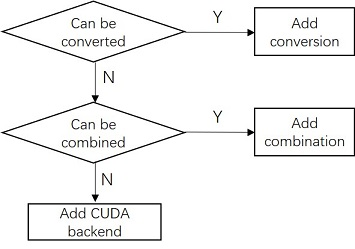

## 1. Add Customize operator

Adding a customize operator requires adding model description and implementation on different architectures.

### 1. Overview

Adding cuda Op in `PPLNN` is shown as follows:
1) Add operator definition (if the customize operator has parameters, the operator parameters should also be declared)
2) Add the data types of the operator’s inputs and outputs
3) Add operator shape calculation
4) Add operator data formats of the operator’s inputs and outputs
5) Add kernel interface
6) Add kernel implementation for CUDA
7) Register operator


### 2. Add operator definition

Use "MyOp" as an example for the name of the operator type.
First, create a new folder under the ppl/nn/engines/cuda/optimizer/ops file, such as MyOps. Add a customize operator under this file by creating a file named MyOp.h.

If the operator has parameters, add a private instance of the parameter in MyOp.h. At the same time, you need to create a file named myop_param.h in ppl/common/params/ppl to add a parameter description.

The structure of MyOp.h is as follows:

```C++
class MyOp final : public CudaOptKernel {
public:
    MyOp(const ir::Node* node) : CudaOptKernel(node) {}
    KernelImpl* CreateKernelImpl() const override;
    ppl::common::RetCode Init(const OptKernelOptions&) override;
    ppl::common::RetCode Finalize(const OptKernelOptions& options) override;
private:
    ppl::common::MyOpParam param_;
};
```

If the operator contains parameters, you should add load the parameters by this way in `MyOp::Init()`

```C++
GenericLoadParam<MyOpParam>(options, &param_);
```

### 3. Add the data types of the operator’s inputs and outputs

The data type of the operator’s inputs and outputs is set by the function infer_type_func in `MyOp::init()`. There are several commonly used functions:

```C++
InferDefaultType(info, type); // Set all inputs outputs to the specified type type.
InferHighestType(info, mask); // Select the type with the highest precision from the inputs, and set all inputs and outputs to this type.
InferInheritedType(info); // All Inputs inherit the type of their previous node’s outputs and sets outputs to the data type of first input.

```

You can choose the appropriate function or design an independent function according to the operator. 

Specified type declaration example (the parameter type is **DATATYPE_UNKNOWN** by default):


```C++
infer_type_func_ = [this] (InputOutputInfo* info, datatype_t type) -> RetCode {
	if (type == ppl::common::DATATYPE_UNKNOWN)
		type = ppl::common::DATATYPE_FLOAT16;
	return InferDefaultType(info, type);
};
```

### 4. Add operator shape calculation
The output shapes are set by the function infer_dims_func in `MyOp::init()`. The shape calculation functions of all supported ONNX operators are appended in the folder ppl/nn/oputils. You can directly use or refer to them. 

An Example for shape calculation:

```C++
infer_dims_func_ = [this] (InputOutputInfo* info) -> RetCode {
	auto& in_shape0 = info->GetInput<TensorImpl>(0)->GetShape();
	info->GetOutput<TensorImpl>(0)->GetShape().Reshape
		(in_shape0.GetDims(), in_shape0.GetRealDimCount());
	return RC_SUCCESS;
};
```

the dimension information of the output tensor is directly copy from the dimension information of the first input tensor.

### 5. Add the data formats of the operator’s inputs and outputs

The PPLNN framework currently supports two formats, **NDARRAY (NCHW)** and **NHWC**. According to these two formats, the input and output formats of all operators are currently divided into four conditions. The operator’s formats can be declared in ppl/ nn/engines/cuda/algos/algo_normal.h.
The default setting is that all the input and output formats of the operator are **NDARRAY**. If the customize operator also uses the **NDARRAY** as its input and output format, there is no need to edit. Other operations follow such rules:

1) If the operator only supports inputs and outputs in NHWC format, the name of the operator needs to be written into `nhwc_set_`;
2) If the operator needs its outputs inherit the format of it inputs (like the `Add` operator), the name of the operator needs to be written into `inherited_set_`;
3) If the operator can accept all arranged inputs and fixed use **NDARRAY** as the output (like the `Shape` operator), the name of the operator needs to be written into `arbitrary_set_`.
In addition, when the custom operator contains multiple algorithm implementations, the framework supports selecting algorithms in the compiler stage. The framework will count the running time of each algorithm and record the optimal algorithm, so that the operator can use the highest efficiency algorithm in the execution stage.

To add the selection algorithm, you need to add two files, algo_myop.cc and algo_myop.h, in ppl/nn/engines/cuda/algos/, and register them in algo_filter_manager.cc. The details of implementation  of the selected algorithm can refer to the `TuringHMMAImpgemm::ExcuteTimer()` function in ppl/nn/engines/cuda/algos/alog_conv.h.


### 6. Add kernel interface
Add a new folder MyKernels in ppl/nn/engines/cuda/kernels/. Add two files named MyKernel.h and MyKernel.cc for operators in ppl/nn/engines/cuda/kernels/MyKernels. Normal operators only need two functions: the constructor function and `DoExcute()`. When the operator contains parameters, the function `SetParam()` needs to be added. Default `CanDoExcute()` function will not allow empty tensor as inputs. When the operator has can accept empty tensor, the function `CanDoExcute()` needs to be added (for example, `Resize` operator can accept empty tensor as its second and third inputs).

Example of kernel interface:

```C++
class MyOpKernel : public CudaKernel {
public:
    MyOpKernel(const ir::Node* node) : CudaKernel(node) {}
    void SetParam(const ppl::common::MyOpParam* p) { param_ = p; }
private:
    ppl::common::RetCode DoExecute(KernelExecContext*) override;
private:
    const ppl::common::MyOpParam* param_ = nullptr;
};
```	

You need to manually complete the `DoExcute()` function, call the cuda implementation of the custom operator and write the result to the output tensor.

### 7. Add kernel implementation for cuda



Adding operators should adhere to the principle of conversion first, combination second, and finally adding backend implementations. In this way, the operator can be added quickly, and the function proofreading and performance optimization of the newly added operators can also be omitted. Here provides three methods of adding operators by showing the implementation of existing operators in `PPLNN`.

#### 7.1 Operator Conversion

If the function of the new operator is the intersection of the functions of several existing operators, then the existing operators can be specialized as the specific mode of the new operator, which is the case with `ONNX.DepthToSpace`. In *ppl.kernel.cuda/src/nn/depth_to_space.cu*, you can see that the DCR (depth-column-row) mode of `DepthToSpace` can be realized by `Resahpe`+`Transpose` operators, while the CDR (column-row-depth) mode behaves same as the `SubpixelUp` operator, just call it directly.

#### 7.2 Operator Combination

For operators that cannot be realized by conversion, we try to decompose the calculation steps of the operators, and then use existing operators to achieve each step. `ONNX.Softmax` can be implemented in this way. As *ppl.kernel.cuda/src/nn/softmax.cu* shows. It can be seen that `Softmax` can be decomposed into five sub-steps, `Reduce`+`Sub`+`Exp`+`Reduce`+`Div`, and each step can be implemented by the existing operators. It is worth noting that in order to transfer data between each step, you need to apply for temporary storage. The interface for applying for temporary storage is `CalcTmpBufferSize` (const KernelExecContext& ctx) in ppl.nn/cuda/kernels, and the size of the space is determined by each step of the operator.

#### 7.3 Add Backend

For operators that cannot be realized by conversion and combination, you need add the CUDA implementation of the operator. The progress involves two files in ppl.kernel.cuda, which are the header file *my_kernel.h* in *include* and the implementation file *my_kernel.cu* in *src*. The naming rules of the interface and the parameter list should refer to the existing interface. CMake will automatically search newly added files, so there is no need to update it.

### 8. Register operator

You need to register the customize operator in ppl/nn/engines/cuda/optimizer/opt_kernel_creator_manager.h. Domain is the domain name, default is empty. Type is the name of the operator type. The third one is the class name defined in MyOp.h.

If you want to redefine the domain name, you need to add BridgeOp to the new domain name.

Registration example:


```C++
REGISTER_OPT_KERNEL_CREATOR("new_domain", "Bridge", BridgeOp);
REGISTER_OPT_KERNEL_CREATOR("new_domain", "MyOp", MyOp)
```