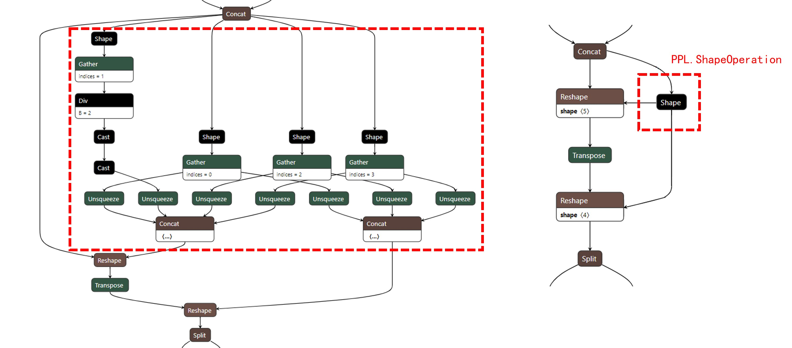

## Explanation for PPL.ShapeOperation

PPL.ShapeOperation is a fusion op designed by OpenPPL.

`Shape` op shows the shape of input tensor. Normally, the output shape will be selected or calculated by other ops like `Gather`, `Concat`, `Add`, `Div` ...

Thus, we design PPL.ShapeOperation to fuse `Shape` and its following ops. There are two main advantages:

1. Reduce the total number of Kernels.
2. Display the meaning of network and work for subsequent fusion.

ShuffleNet is a typical case to show the the fusion results of PPL.ShapeOperation.

